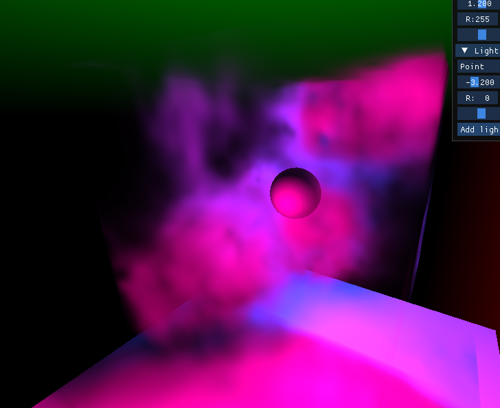
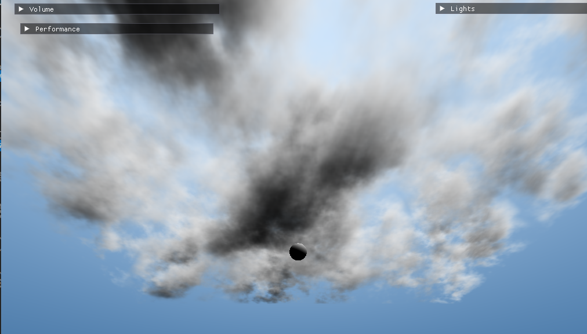

# IGR202 Course Project : Real-time volumetric cloud rendering
*By Telo PHILIPPE*  
This is my project for my IGR course in Telecom Paris. My goal is to render real time volumetric clouds, using volume raymarching in a deferred pipeline.  
I re-used some boilerplate code from the first practical project of this class (Interactive solar system), and adapted it to allow deferred rendering.

## How to run with CMake
- Clone the project with `git clone https://github.com/StormCreeper/Volumetric-Cloud-Rendering.git`
- Update the dependencies if it is not done automatically: `git submodule update --init --recursive`
- In the root folder,  run `cmake -C build`
- `cd build`, then compile with `make` (it may take some time to build the libraries)
- Finally, run the executable: `./IGR_Clouds`

## Implemented
- Traditionnal mesh rendering with rasterization
- Deferred rendering pipeline
- Volume raymarching and lighting, with multiple lights
- GUI to configure the lights and volume parameters
- Volume traversing in a pre-computed texture instead of mathematical function
- Compute the texture in a compute shader
## Todo
- More accurated cloud volume generation with different kinds of noise
- Different heights of clouds (for the moment, they lie on a plane)
- Render the clouds at quarter resolution to speedup the rendering pass
- Flight simulator ??
## Renders
Here are some renders with a basic density function and colored lights  
  
  
First success with a 3D texture for the density map.  
  
Changed the sky and volume shape to make it look like clouds:  

Added a time offset and recomputing every 5 frames:  

https://github.com/StormCreeper/Volumetric-Cloud-Rendering/assets/33285021/3514d8f1-56ba-4fa0-9bd2-03aa92fe8745

