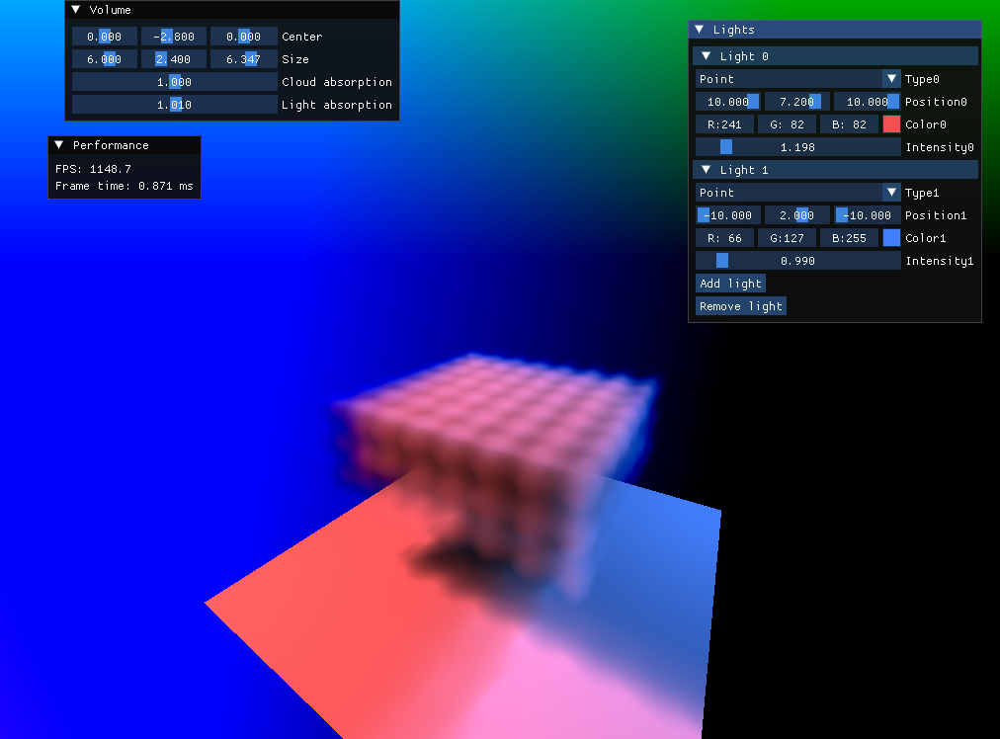
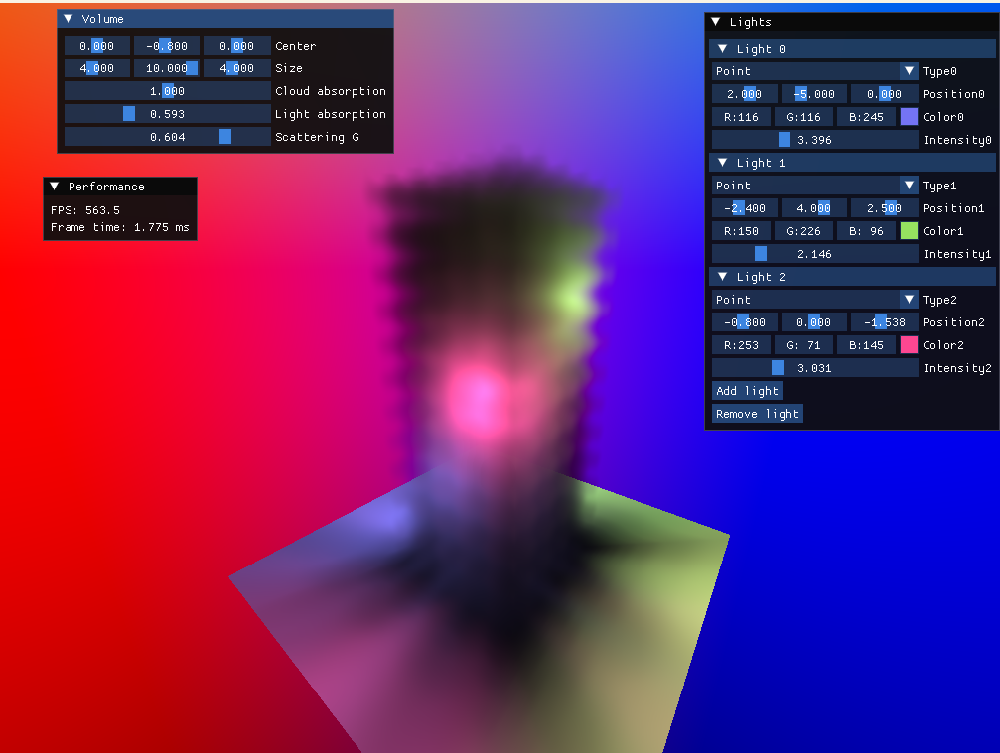

# IGR202 Course Project : Real-time volumetric cloud rendering
*By Telo PHILIPPE*  
This is my project for my IGR course in Telecom Paris. My goal is to render real time volumetric clouds, using volume raymarching in a deferred pipeline.  
I re-used some boilerplate code from the first practical project of this class (Interactive solar system), and adapted it to allow deferred rendering.  

## Implemented
- Traditionnal mesh rendering with rasterization
- Deferred rendering pipeline
- Basic volume raymarching and lighting, with multiple lights
- GUI to configure the lights and volume parameters
- Simple density function in the shader
## Todo
- Volume traversing in a pre-computed texture instead of mathematical function
- Compute the texture in a compute shader
- More accurated cloud volume generation with different kinds of noise
## Renders
Here are some renders with a basic density function and colored lights  
  
  
